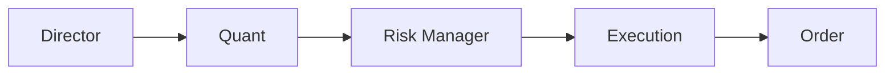

[Vibe-Trading](/docs/ai/vibe-trading/) stops at research and asks before it touches a
broker. [AutoHedge](https://github.com/The-Swarm-Corporation/AutoHedge) doesn't stop. It
splits the job across four agents and runs the whole loop — analysis, decision, risk
sizing, execution — against a live Solana wallet.

That makes it the most interesting and the most dangerous page in this category. Read the
last section before the first.

## The pipeline



| Agent | Job |
|---|---|
| Director | Generates the strategy and the thesis, and picks the tickers |
| Quant | Technical and statistical analysis |
| Risk Manager | Position sizing and risk assessment |
| Execution | Turns the decision into an order |

Each stage emits structured JSON, so the reasoning is inspectable rather than a wall of
prose — which matters a great deal when you are trying to work out why it bought
something. It's built on the [Swarms](https://swarms.ai) agent framework, MIT-licensed.

## Run it

```bash
pip install -U autohedge
```

```python
from autohedge import AutoHedge

trading_system = AutoHedge(
    name="swarms-fund",
    description="Private Hedge Fund",
)

print(trading_system.run(
    task="Analyze the sentiment of the oil market and provide a thesis on "
         "the overall market position and expected trends."
))
```

There's also an `autohedge` CLI. Configuration is a `.env`:

```dotenv
JUPITER_API_KEY=          # token price and search
OPENAI_API_KEY=
ANTHROPIC_API_KEY=
WORKSPACE_DIR="agent_workspace"
WALLET_PRIVATE_KEY=""     # read this line twice
```

Solana is the supported venue today, through Jupiter. Coinbase and other exchanges are
listed as coming.

## What you're actually signing up for

- **You are putting a wallet private key in a `.env` file** and handing spend authority to
  an LLM pipeline. Nothing between the thesis and the order asks you to confirm. Use a
  fresh wallet funded with an amount whose total loss would be merely annoying, and never
  a key that also holds anything else.
- **The README's claims run ahead of its documentation.** "Enterprise-grade" and
  "institutional reliability" describe the intent; what's documented is four agents, an
  env file, and one example. There is no documented dry-run or paper mode, no published
  backtest, and no stated risk limits you can configure — the "risk-first architecture"
  is an agent asked to think about risk, not a hard cap the code enforces.
- **Check the commit dates before you trust it with money.** As of this writing the last
  push was several months back. In a repository that executes trades, staleness is a
  material fact, not a detail.
- **An LLM cannot know whether an edge is real.** The pipeline will produce a confident
  thesis for anything you point it at, including noise. Confidence is the output it is
  best at.
- **Autonomous trading may not be legal for you to run as-is.** Managing other people's
  money, in most jurisdictions, is a licensed activity. Your own funds are your own
  business; the moment anyone else's are involved, that's a question for a lawyer, not a
  README.

## Where it fits

| Want | Reach for |
|---|---|
| To study how a multi-agent trading pipeline is structured | AutoHedge — read the source, run it without a key |
| To research and backtest before risking anything | [Vibe-Trading](/docs/ai/vibe-trading/) |
| To actually run capital autonomously | Neither, without your own testing, limits, and kill switch |

The genuinely useful thing here is the architecture: four narrow agents with one job
each, structured hand-offs between them, and a risk stage that exists as a separate
step. That pattern is worth borrowing whatever domain you work in. Borrowing the pattern
costs nothing. Running the loop costs whatever is in the wallet.

## Next

None of that matters if you can't tell whether the output is any good →
[promptfoo](/docs/ai/promptfoo/)
