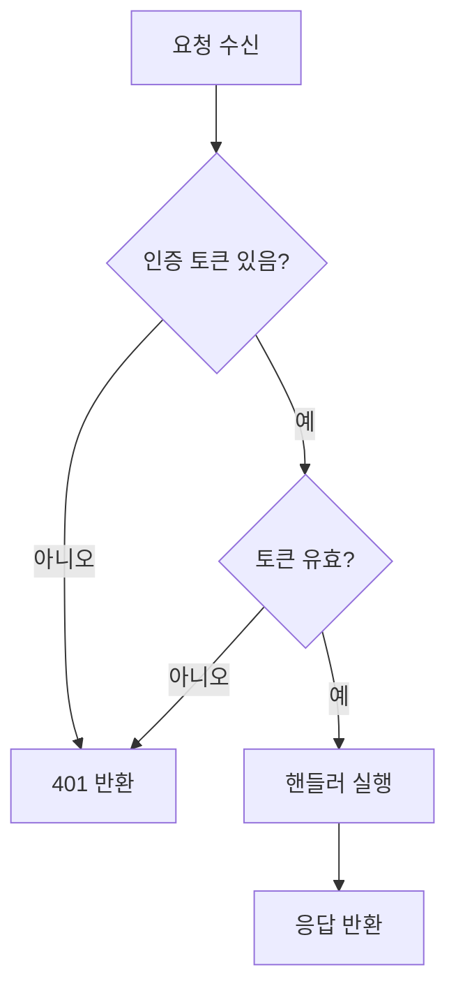
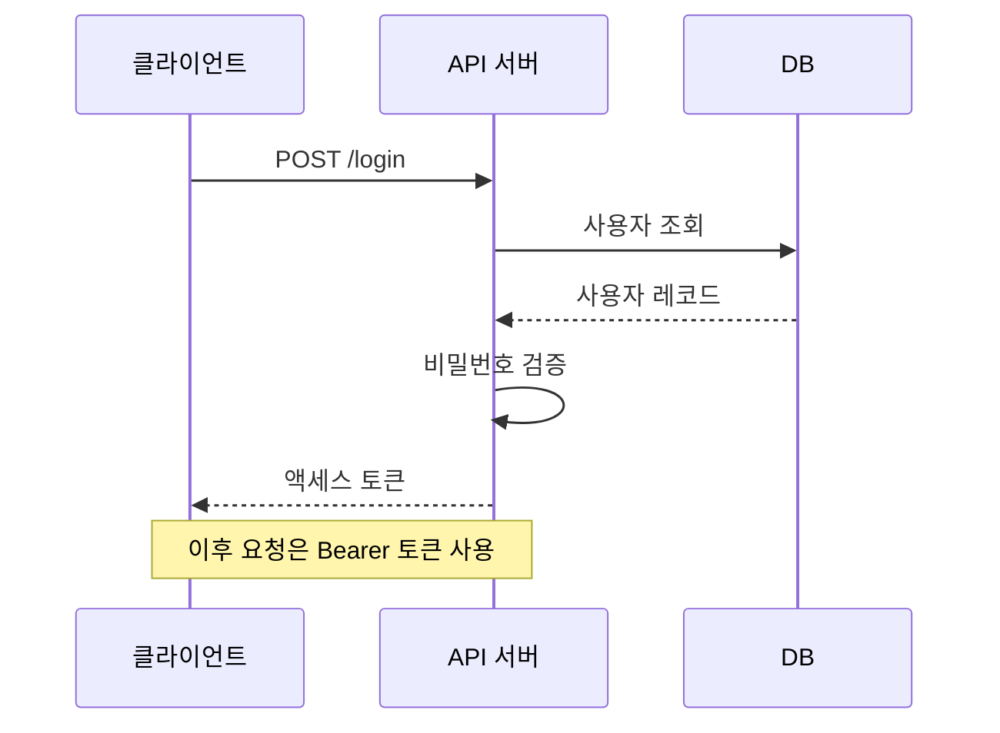
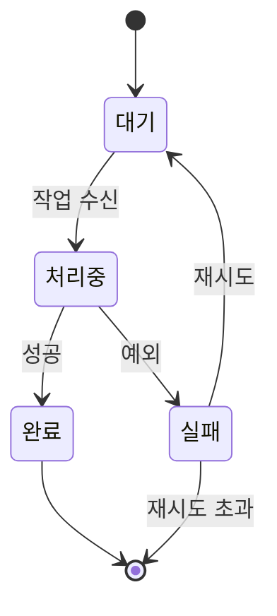
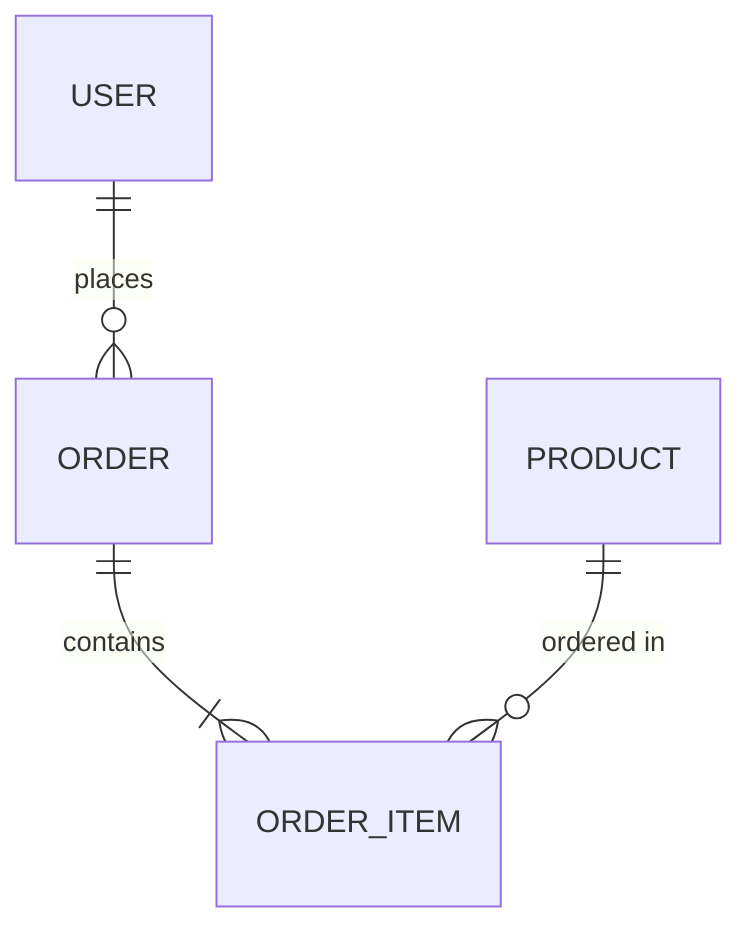
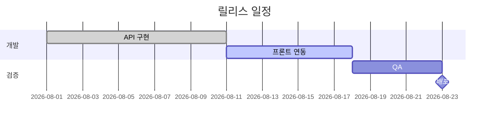

이미지로 만든 다이어그램은 수정할 때마다 원본 파일을 찾아야 하고, diff에서
무엇이 바뀌었는지 보이지 않습니다. Mermaid는 텍스트라서 **PR에서 변경점이 그대로
읽힙니다.**

GitHub, GitLab, Notion, Obsidian, 그리고 이 사이트를 포함한 대부분의 문서
도구가 기본 지원합니다.

## 순서도

````markdown

````


방향은 `TD`(위→아래), `LR`(왼→오른쪽), `BT`, `RL` 중에 고릅니다.

| 모양 | 문법 |
|---|---|
| 사각형 | `A[텍스트]` |
| 둥근 사각형 | `A(텍스트)` |
| 마름모(조건) | `A{텍스트}` |
| 원통(DB) | `A[(텍스트)]` |
| 원 | `A((텍스트))` |

| 화살표 | 문법 |
|---|---|
| 실선 | `-->` |
| 점선 | `-.->` |
| 굵은 선 | `==>` |
| 라벨 | `-->|텍스트|` |

## 시퀀스 다이어그램

API 흐름을 설명할 때 가장 자주 씁니다.

````markdown

````


`->>`는 실선 화살표, `-->>`는 점선(응답), `->>+` / `-->>-`는 활성화 박스를
켜고 끕니다.

## 상태 다이어그램

````markdown

````


## ER 다이어그램

````markdown

````


## 간트 차트

````markdown

````


## 실전 요령

- **먼저 [Mermaid Live Editor](https://mermaid.live)에서 만들어 보세요.** 문법
  오류를 바로 확인할 수 있습니다.
- **노드는 10개 안쪽으로.** 그보다 커지면 다이어그램 두 개로 나누는 편이 읽힙니다.
- **괄호나 콜론이 들어간 라벨은 따옴표로 감쌉니다**: `A["처리 (비동기)"]`
- **한글 라벨도 그대로 됩니다.** 다만 특수문자가 섞이면 따옴표를 쓰세요.
- 렌더링이 안 되면 대개 들여쓰기나 화살표 문법 오타입니다. 한 줄씩 지워가며
  범인을 찾는 것이 가장 빠릅니다.

## 다음 단계

정형화되지 않은 그림이 필요하다면 → [Excalidraw](/docs/writing/excalidraw/)
