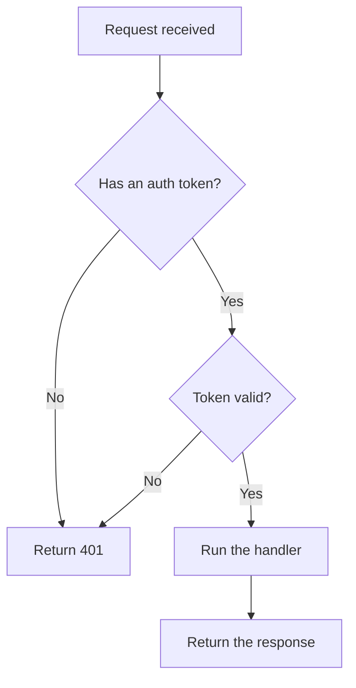
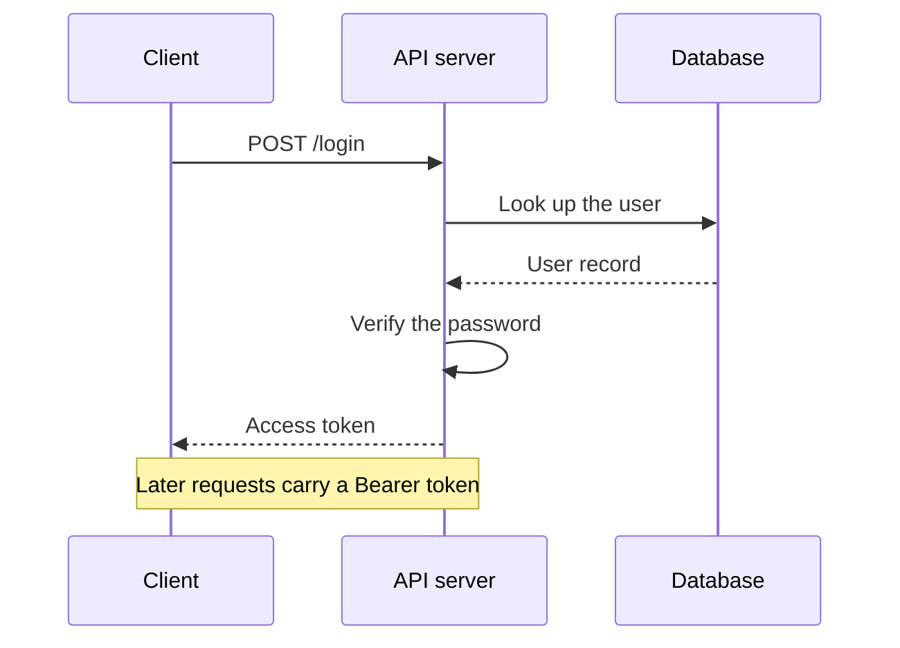
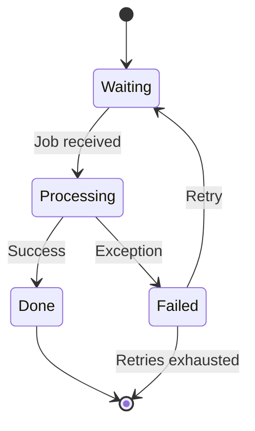
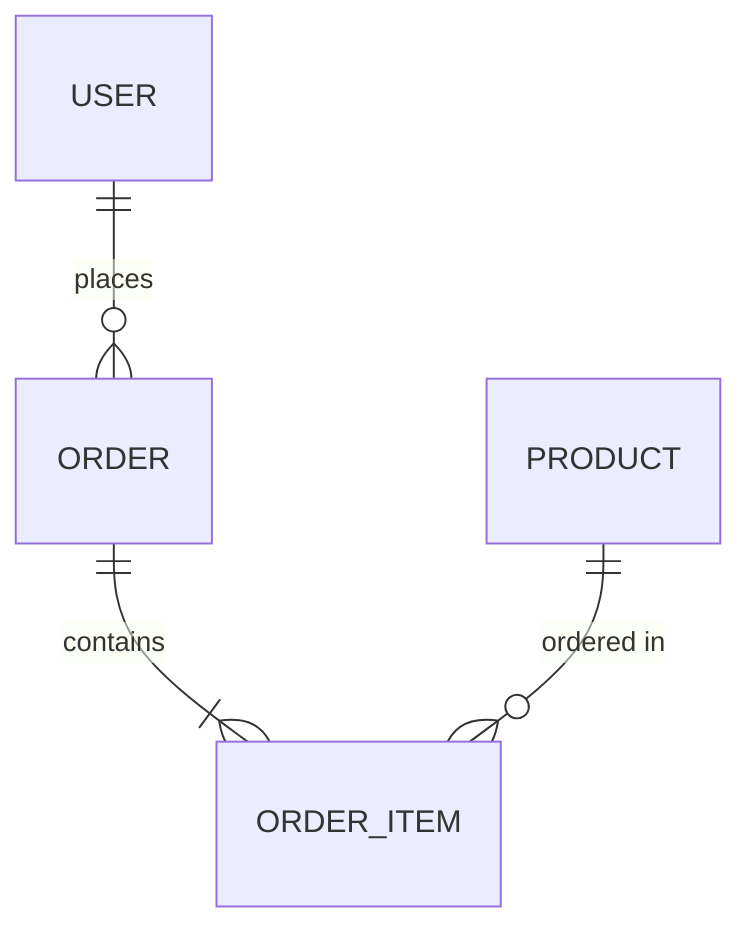
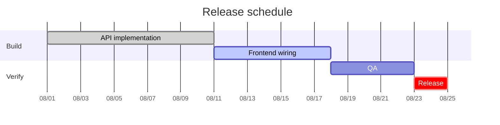

A diagram exported as an image means hunting for the source file every time it changes,
and a diff that shows nothing. Mermaid is text, so **the change is legible right in the
pull request.**

GitHub, GitLab, Notion, Obsidian, and most documentation tools — this site included —
support it out of the box.

## Flowcharts

````markdown

````


Pick a direction from `TD` (top-down), `LR` (left-right), `BT`, or `RL`.

| Shape | Syntax |
|---|---|
| Rectangle | `A[text]` |
| Rounded | `A(text)` |
| Diamond (decision) | `A{text}` |
| Cylinder (database) | `A[(text)]` |
| Circle | `A((text))` |

| Arrow | Syntax |
|---|---|
| Solid | `-->` |
| Dotted | `-.->` |
| Thick | `==>` |
| Labelled | `-->\|text\|` |

## Sequence diagrams

The one you'll reach for most when explaining an API flow.

````markdown

````


`->>` is a solid arrow, `-->>` a dotted one (a response), and `->>+` / `-->>-` turn
activation boxes on and off.

## State diagrams

````markdown

````


## Entity relationships

````markdown

````


## Gantt charts

````markdown

````


## Practical advice

- **Draft in the [Mermaid Live Editor](https://mermaid.live) first.** Syntax errors show
  up immediately.
- **Keep it under about ten nodes.** Past that, two diagrams read better than one.
- **Quote labels containing brackets or colons**: `A["Processing (async)"]`
- If it won't render, it's almost always indentation or an arrow typo. Deleting one line
  at a time finds the culprit fastest.

## Next

For drawings that refuse to be formalised → [Excalidraw](/docs/writing/excalidraw/)
